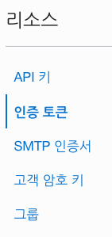
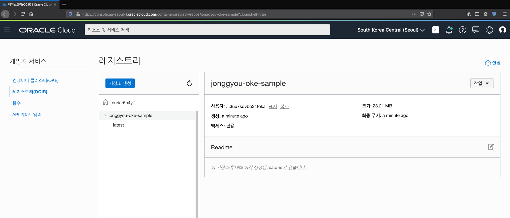

# OKE에 애플리케이션 배포하기

## Docker Registry 에 push 하기

도커 이미지를 레지스트리에 push 하기 위해서는 login을 해야 합니다.

### hub.docker.com 에 푸시하기 - Public

1. login 하기

    기본적으로 push 는 docker.io 에 이미지를 push 한다.  
    자신의 도커 이미지를 push 하기 위해서 docker.io 에 로그인을 한다.

    ~~~
    docker login
    ~~~

    다음과 같이 id/pw를 입력하는 화면이 나오면 입력한다.
    ~~~
    Login with your Docker ID to push and pull images from Docker Hub. If you don't have a Docker ID, head over to https://hub.docker.com to create one.
    Username: <사용자ID>
    Password: <사용자PW>
    WARNING! Your password will be stored unencrypted in /home/jonggyou_k/.docker/config.json.
    Configure a credential helper to remove this warning. See
    https://docs.docker.com/engine/reference/commandline/login/#credentials-store

    Login Succeeded
    ~~~

1. tag 생성

    이전 항목에서 우리는 oke-sample 이라는 docker image를 생성하였다.  
    Docker Hub 내의 자신의 ID에 이미지를 두기 위해서는 Tag명이 **<사용자ID>/<이미지명>** 이어야 한다.
    ~~~
    docker tag oke-sample <사용자ID>/oke-sample
    ~~~

    아래와 같이 확인하면 새로운 Tag명으로 생성된 docker image가 보인다.
    ~~~
    $ docker tag oke-sample shiftyou/oke-sample
    $ docker images

    REPOSITORY            TAG                 IMAGE ID            CREATED              SIZE
    oke-sample            latest              b3851a172fd8        About a minute ago   82.5MB
    shiftyou/oke-sample   latest              b3851a172fd8        About a minute ago   82.5MB
    node                  8-alpine            2b8fcdc6230a        4 months ago         73.5MB
    ~~~

1. push 하기
    ~~~
    docker push <사용자ID>/<이미지명>
    ~~~
    아래와 같이 `docker.io/<사용자ID>/이미지명` 으로 push 하는 로그들이 나오고 완료된다.
    ~~~
    $ docker push shiftyou/oke-sample

    The push refers to repository [docker.io/shiftyou/oke-sample]
    9ad596b6507c: Preparing 
    89015aa9a76a: Preparing 
    7d76b70f6e3c: Preparing 
    8e27730a26d6: Preparing 
    6b73202914ee: Preparing 
    9851b6482f16: Waiting 
    540b4f5b2c41: Waiting 
    ...
    ~~~

    >누구나 사용 가능한 이미지로 Kubernetes 에서도 secret 정보 필요없이 사용 가능하다.

### OCIR(Oracle Cloud Infrastructure Registry)에 푸시하기 - Private

1. token 만들기

    Private한 환경인 OCIR에 이미지를 push 하기 위해서는 인증토큰이 필요하다.

    1. 우측 상단의  아이콘을 클릭하고 `사용자 설정` 을 선택한다.

        

    1. 좌측의 리스트에서 `인증토큰`을 선택한다.

        

    1. `토큰 생성`을 선택하여 설명부분에 설명을 쓰고 토큰을 생성한다.  

        한번 생성된 토큰은 다시 볼 수 없기에 생성되고 나면 복사를 해 둔다.

1. login 하기

    좌측 상위메뉴에서 `개발자서비스` >`레지스트리(OCIR)`을 선택하면 다음과 같은 화면이 보여진다.

    

    위 화면에서 *cnriar6c4yj1* 라는 명이 태넌시 명이다. 이를 이용하여 로그인을 한다.

    현재 Seoul 리젼을 쓰기 때문에 icn.ocir.io 에 로그인을 한다.
    ~~~
    docker login icn.ocir.io
    ~~~

    입력할 항목은 영역에는 다음을 입력한다.
    ~~~html
     Username : <태넌트ID>/<사용자ID> 
     Password : <토큰>
    ~~~

    입력사항은 다음에서 찾을 수 있다.

    1. 좌측 상위메뉴에서 `개발자서비스` >`레지스트리(OCIR)`을 선택하면 다음과 같은 화면이 보여진다.

        

        빨간 박스 부분이 <태넌트ID>이다. 

    2. 우측 상단의  아이콘을 클릭하고 `사용자 설정` 을 선택한다.

        

        
        빨간 박스 부분이 <사용자ID>이다. 

    Username 항목에는 위의 <태넌트ID>/<사용자ID> 를 입력한다. 위의 화면을 예를 들면 다음과 같다.
    ~~~
    cnriar6c4yj1/oracleidentitycloudservice/jonggyou.kim@oracle.com
    ~~~

    그리고 패스워드는 이전에 기록한 토큰을 사용한다.

    ~~~
    $ docker login icn.ocir.io

    Username: cnriar6c4yj1/oracleidentitycloudservice/jonggyou.kim@oracle.com
    Password: 
    WARNING! Your password will be stored unencrypted in /home/jonggyou_k/.docker/config.json.
    Configure a credential helper to remove this warning. See
    https://docs.docker.com/engine/reference/commandline/login/#credentials-store

    Login Succeeded
    ~~~

 `` ``

1. tag 생성

    OCIR에 이미지를 두기 위해서는 Tag명이 `<OCIR>/<태넌트ID>/<이미지명>` 이어야 한다.  
    사용자별 또는 프로젝트별로 관리하기 위하여 `<이미지명>`을 `<사용자ID>-oke-sample` 으로 구성하도록 한다.

    ~~~
    docker tag oke-sample <OCIR>/<태넌트ID>/<사용자ID>-oke-sample
    ~~~
    - \<OCIR> : icn.ocir.io
    - \<태넌트ID> : cnriar6c4yj1
    - \<이미지명> : jonggyou-oke-sample

    아래와 같이 확인하면 새로운 Tag명으로 생성된 docker image가 보인다.
    ~~~
    $ docker tag oke-sample icn.ocir.io/cnriar6c4yj1/jonggyou-oke-sample
    $ docker images

    REPOSITORY                                     TAG                 IMAGE ID            CREATED             SIZE
    shiftyou/oke-sample                            latest              b3851a172fd8        2 hours ago         82.5MB
    icn.ocir.io/cnriar6c4yj1/jonggyou-oke-sample   latest              b3851a172fd8        2 hours ago         82.5MB
    oke-sample                                     latest              b3851a172fd8        2 hours ago         82.5MB
    node                                           8-alpine            2b8fcdc6230a        4 months ago        73.5MB
    ~~~

1. push 하기

    ~~~
    $ docker push icn.ocir.io/cnriar6c4yj1/jonggyou-oke-sample

    The push refers to repository [icn.ocir.io/cnriar6c4yj1/jonggyou-oke-sample]
    9ad596b6507c: Pushed 
    89015aa9a76a: Pushed 
    7d76b70f6e3c: Pushed 
    8e27730a26d6: Pushed 
    6b73202914ee: Pushed 
    9851b6482f16: Pushed 
    540b4f5b2c41: Pushed 
    6b27de954cca: Pushed 
    latest: digest: sha256:bdc0574ee9b802e075df623f052a3d7b981fcb4e883d6d67e8489de445407521 size: 1993
    ~~~

    다음과 같이 OCIR에 등록되었음을 알 수 있다.

    

    >인증된 사용자만 pull 할 수 있는 이미지로 Kubernetes에서 sercret 정보 설정이 필요하다.

## OKE에 배포하기

### MySQL 배포하기

1. Deployment 

1. Service

### 애플리케이션 배포하기

1. Deployment 

1. Service

## 테스트 하기

---
완료하셨습니다. <a href="javascript:history.back();">뒤로가기</a>
