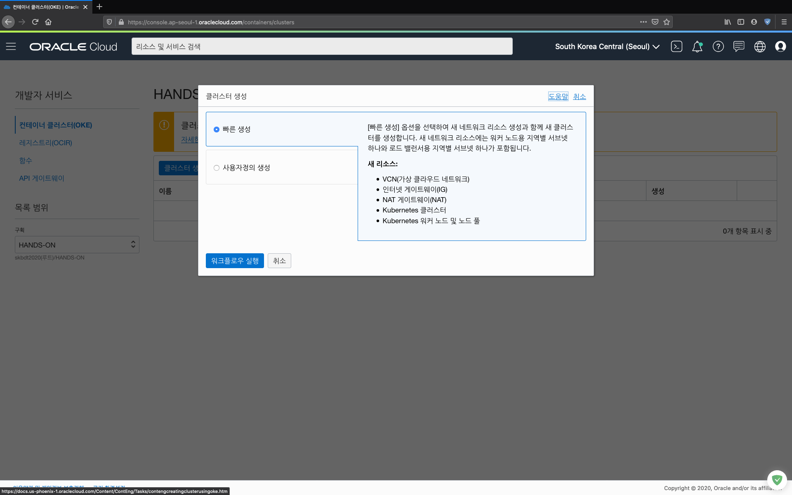
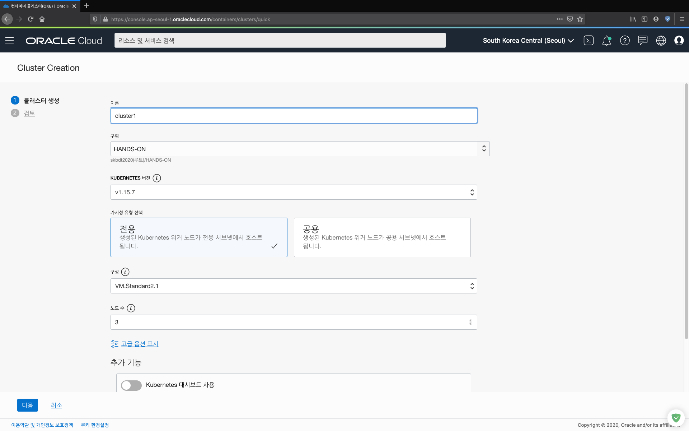
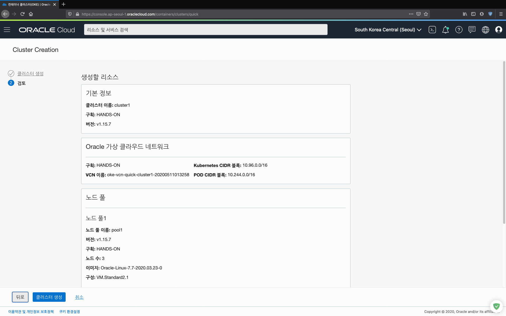
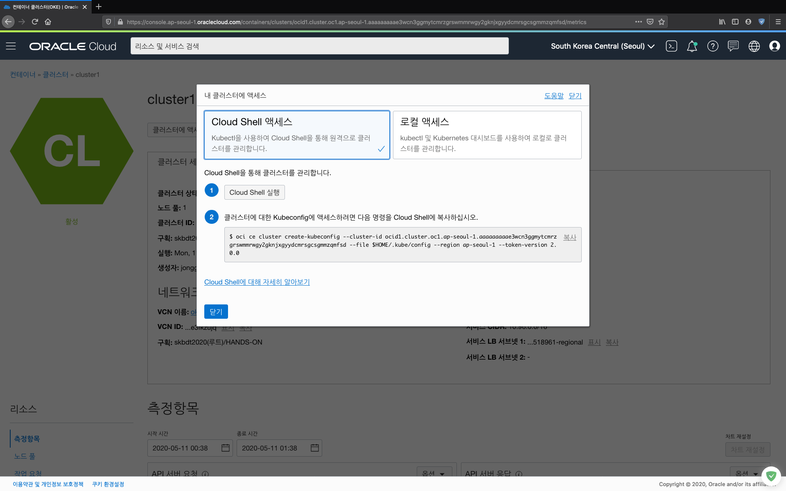
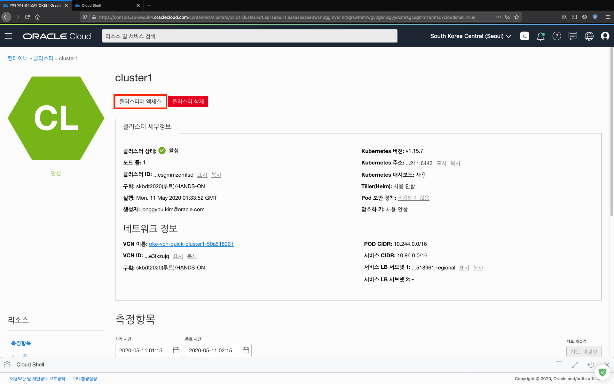
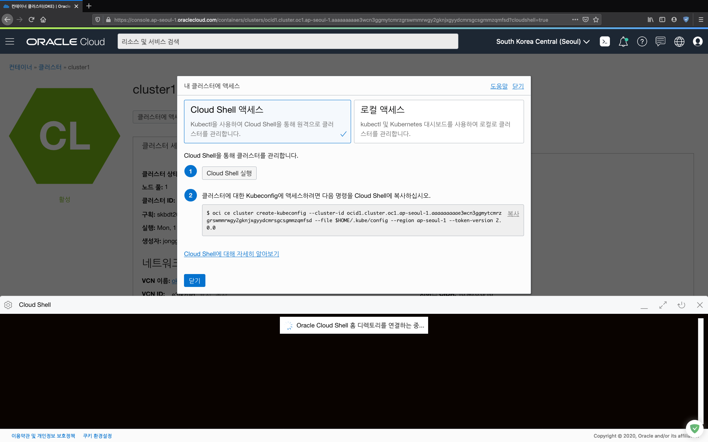

# OKE 클러스터 생성

1. OKE 클러스터 생성  
	화면의 ***"클러스터 생성"*** 을 눌러 클러스터를 생성한다. 아래와 같이 화면이 나오면 ***"워크플로우 실행"*** 을 선택한다.

	
	
1. 환경을 설정하는 화면이다. ***"다음"*** 을 누른다.

	

1. 생성되는 환경을 확인하는 작업이다. ***"클러스터 생성"*** 을 누른다.

	

1. 클러스터가 생성되는 단계를 보여준다. 끝나면 확인을 눌러준다.

	

1. 클러스터가 생성되고, 실제 노드들을 생성하는 단계이다.   
	컴퓨트 노드를 생성하고, Kuberntes가 필요로 하는 파일들을 설치하는 작업을 자동으로 완료한다. 설치에는 약간의 시간이 걸린다.  
	생성된 노드들은 **컴퓨트/인스턴스** 에서 확인할 수 있다.

	

1. ***"클러스터 액세스"*** 를 누르면 OKE 클러스터에 접근할 수 있는 방법을 볼 수 있다.

	

# Cloud Shell 실행

1. ***"클러스터에 액세스"*** 를 눌러 클러스터 액세스 방법을 연다.

	

1. 화면의 1번으로 표시된 ***"Cloud Shell 실행"*** 을 눌러 Cloud Shell을 실행한다.

	화면 우측 위의  아이콘을 눌러도 된다.

	

1. 프롬프트가 나오면 화면의 2번으로 표시된 oci 명령어를 입력한다.
	~~~
	$ oci ce cluster create-kubeconfig --cluster-id ocid1.cluster.oc1.ap-seoul-1.aaaaaaaaae3wcn3gxxxxxcmrsgcsgmmzqmfsd --file $HOME/.kube/config --region ap-seoul-1 --token-version 2.0.0 

	New config written to the Kubeconfig file /home/jonggyou_k/.kube/config
	~~~

1. 이제 OKE 클러스터에 접근할 수 있다.  

	다음의 명령어를 통해 현재 클러스터의 정보를 볼 수 있다.
	~~~
	$ kubectl cluster-info

	Kubernetes master is running at https://192.29.25.211:6443
	CoreDNS is running at https://192.29.25.211:6443/api/v1/namespaces/kube-system/services/kube-dns:dns/proxy

	To further debug and diagnose cluster problems, use 'kubectl cluster-info dump'.
	~~~

# 네임스페이스 생성

여러사람이 하나의 클러스터에서 수행을 하여 각자의 환경을 구별하기로 한다. 이는 쿠버네티스의 namesapce 를 통해 설정한다.

1. 현재의 namespace 보기

	다음과 같이 현재의 네임스페이스를 볼 수 있다.
	~~~
	$ kubectl get namespace

	NAME              STATUS   AGE
	default           Active   84m
	kube-node-lease   Active   84m
	kube-public       Active   84m
	kube-system       Active   84m
	~~~~

	위와 같이 현재 4개의 네임스페이스가 존재한다.

1. 새로운 네임스페이스를 생성한다. 이름은 자신의 아이디로 한다.
	~~~
	$ kubectl create namespace jonggyou

	namespace/jonggyou created
	~~~

	그리고 네임스페이스 리스트를 본다. 다음과 같이 새로운 네임스페이스가 생성됨을 알 수 있다.
	~~~
	$ kubectl get namespaces

	NAME              STATUS   AGE
	default           Active   91m
	jonggyou          Active   9s
	kube-node-lease   Active   91m
	kube-public       Active   91m
	kube-system       Active   91m
	~~~

1. 현재 환경의 기본 네임스페이스를 살펴본다.
	~~~
	$ kubectl config get-contexts

	CURRENT   NAME                  CLUSTER               AUTHINFO           NAMESPACE
	*         context-csgmmzqmfsd   cluster-csgmmzqmfsd   user-csgmmzqmfsd   
	~~~
	현재 비어있고 이것은 default 네임스페이스를 사용함을 의미힌다.

1. 자신의 만든 네임스페이스를 사용하도록 수정한다.
	~~~
	$ kubectl config set-context --current --namespace jonggyou

	Context "context-csgmmzqmfsd" modified.
	~~~

1. 확인힌다.
	~~~
	$ kubectl config get-contexts

	CURRENT   NAME                  CLUSTER               AUTHINFO           NAMESPACE
	*         context-csgmmzqmfsd   cluster-csgmmzqmfsd   user-csgmmzqmfsd   jonggyou
	~~~

	이로서 모든 리소스 생성은 기본으로 새로운 네임스페이스에서 이루어 진다. (물론 명시적으로 다른 네이밍 스페이스에서 처리 가능하다.)

---
완료하셨습니다.